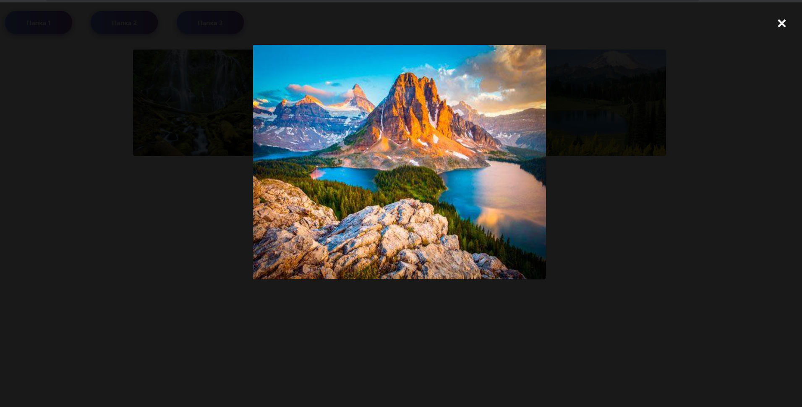

#Тестовое задание: ajax,php,js,slider
Проект представляет из себя реализацию ajax-запроса посредством нажатия на одну из 3 кнопок.

После нажатия происходит ajax-запрос в PHP файл. PHP выдаёт html код, который служить основой для обработки javascript. Он создаёт слайдер с 6 изображениями.

Каждая кнопка — новый слайдер.

При нажатии на картину появится модальное окно выбранного изображения.

